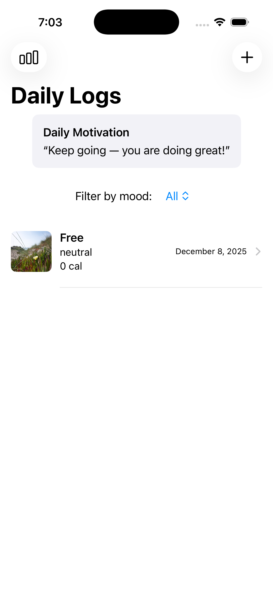
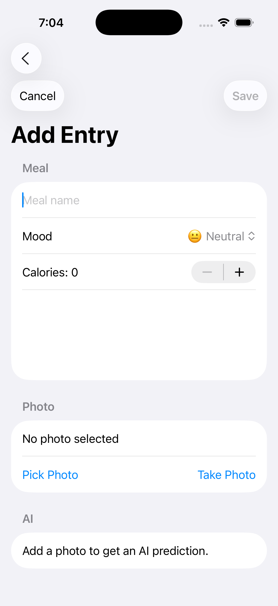
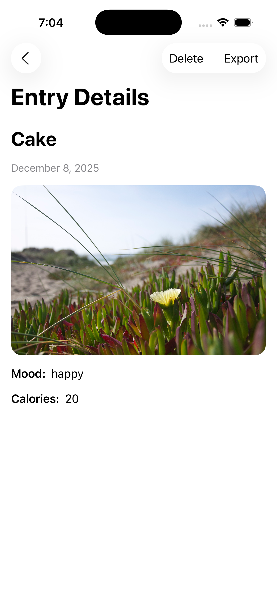
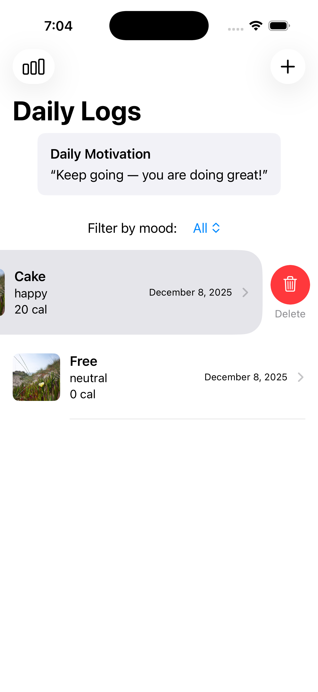
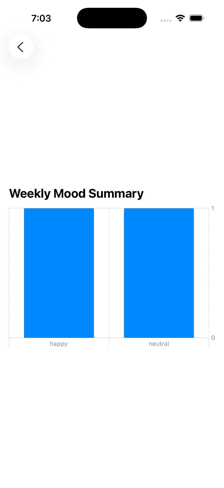

<h1>FoodMood – Meal and Mood Tracker with AI</h1>

FoodMood is an iOS app built using <strong>SwiftUI, Core Data, CoreML, Vision, and URLSession</strong>.
Track daily meals and moods, classify food photos using AI, export entries, and stay motivated with daily quotes.

<h2>1. App Screenshots</h2>

Below are the actual app images from the <code>Images/</code> folder.

<table style="width:100%; text-align:center;" border="1" cellspacing="0" cellpadding="10">
  <tr>
    <th>Feature</th>
    <th>Screenshot</th>
  </tr>
  
  <tr>
    <td><strong>Home / Daily Log List</strong></td>
    <td></td>
  </tr>
  <tr>
    <td><strong>Add Entry Screen</strong></td>
    <td></td>
  </tr>
  <tr>
    <td><strong>Entry Detail View</strong></td>
    <td></td>
  </tr>
  <tr>
    <td><strong>Delete Confirmation Flow</strong></td>
    <td></td>
  </tr>
  <tr>
    <td><strong>Weekly Summary Report</strong></td>
    <td></td>
  </tr>
</table>

<h2>1.1. Project File Structure</h2>

The following table shows the organized structure of the FoodMood Xcode project:

<table border="1" cellspacing="0" cellpadding="10" style="width:100%; text-align:left;">
  <tr>
    <th>Directory / File</th>
    <th>Description</th>
  </tr>

  <tr>
    <td><code>FoodMood/</code></td>
    <td>Root Xcode project folder</td>
  </tr>

  <tr>
    <td><code>FoodMood/Models/</code></td>
    <td>
      Contains model structs and enums: 
      • <code>LogEntry</code> (Core Data) 
      • <code>Mood.swift</code> 
      • <code>Quote.swift</code>
    </td>
  </tr>

  <tr>
    <td><code>FoodMood/ViewModels/</code></td>
    <td>
      Houses the MVVM ViewModels: 
      • <code>AddEntryViewModel.swift</code> 
      • <code>AIRecognitionViewModel.swift</code> 
      • <code>QuoteViewModel.swift</code>
    </td>
  </tr>

  <tr>
    <td><code>FoodMood/Views/Main/</code></td>
    <td>
      Main UI screens: 
      • <code>DailyLogListView.swift</code> 
      • <code>LogRowView.swift</code> 
      • <code>WeeklySummaryView.swift</code> 
      • <code>QuoteBannerView.swift</code>
    </td>
  </tr>

  <tr>
    <td><code>FoodMood/Views/AddEntry/</code></td>
    <td>
      Add Entry flow UI: 
      • <code>AddEntryView.swift</code>
    </td>
  </tr>

  <tr>
    <td><code>FoodMood/Views/Detail/</code></td>
    <td>
      Entry detail + export: 
      • <code>DetailView.swift</code>
    </td>
  </tr>

  <tr>
    <td><code>FoodMood/Views/AIRecognition/</code></td>
    <td>
      AI recognition UI: 
      • <code>AIPredictionView.swift</code>
    </td>
  </tr>

  <tr>
    <td><code>FoodMood/Views/Shared/</code></td>
    <td>
      Reusable components: 
      • <code>ImagePickerView.swift</code> 
      • <code>ShareSheet.swift</code>
    </td>
  </tr>

  <tr>
    <td><code>FoodMood/AI/</code></td>
    <td>
      Machine learning integration: 
      • <code>CoreMLManager.swift</code> 
      • <code>FoodClassifier.mlmodel</code> (include in submission)
    </td>
  </tr>

  <tr>
    <td><code>FoodMood/Networking/</code></td>
    <td>
      Networking layer: 
      • <code>QuoteService.swift</code>
    </td>
  </tr>

  <tr>
    <td><code>FoodMood/FileExport/</code></td>
    <td>
      Export logic: 
      • <code>FileExportManager.swift</code>
    </td>
  </tr>

  <tr>
    <td><code>FoodMood/Images/</code></td>
    <td>
      UI screenshots: 
      • <code>home.png</code> 
      • <code>add_entry.png</code> 
      • <code>entry.png</code> 
      • <code>delete.png</code> 
      • <code>report.png</code>
    </td>
  </tr>

  <tr>
    <td><code>FoodMood/Persistence/</code></td>
    <td>
      Core Data stack: 
      • <code>PersistenceController.swift</code> 
      • <code>FoodMood.xcdatamodeld</code>
    </td>
  </tr>

  <tr>
    <td><code>README.md</code></td>
    <td>Project documentation & instructions</td>
  </tr>
</table>

<h3>Tree View</h3>

<pre>
FoodMood/
│── FoodMood.xcodeproj
│── README.md
│── FoodMood/
│   ├── Models/
│   │   ├── Mood.swift
│   │   ├── Quote.swift
│   │   └── LogEntry (Core Data)
│   ├── ViewModels/
│   │   ├── AddEntryViewModel.swift
│   │   ├── QuoteViewModel.swift
│   │   └── AIRecognitionViewModel.swift
│   ├── Views/
│   │   ├── Main/
│   │   │   ├── DailyLogListView.swift
│   │   │   ├── LogRowView.swift
│   │   │   ├── WeeklySummaryView.swift
│   │   │   └── QuoteBannerView.swift
│   │   ├── AddEntry/AddEntryView.swift
│   │   ├── Detail/DetailView.swift
│   │   ├── AIRecognition/AIPredictionView.swift
│   │   └── Shared/
│   │       ├── ImagePickerView.swift
│   │       └── ShareSheet.swift
│   ├── FileExport/FileExportManager.swift
│   ├── Networking/QuoteService.swift
│   ├── AI/CoreMLManager.swift
│   ├── Images/
│   │   ├── home.png
│   │   ├── add_entry.png
│   │   ├── entry.png
│   │   ├── delete.png
│   │   └── report.png
│   └── Persistence/
│       ├── PersistenceController.swift
│       └── FoodMood.xcdatamodeld
</pre>

<h2>2. Features (Rubric-Based)</h2>

<h3>Daily Log Screen</h3>
<ul>
  <li>Dynamic Core Data list using <code>@FetchRequest</code></li>
  <li>Swipe-to-delete removes entries permanently</li>
  <li>Toolbar add button</li>
  <li>Mood filter menu (All / 😀 Happy / 😢 Sad / 😴 Tired / etc.)</li>
</ul>

<h3>Add Entry Screen</h3>
<ul>
  <li>TextField, Picker, Stepper, TextEditor</li>
  <li>Image Picker for choosing photos</li>
  <li>AI classification triggered after selecting image</li>
  <li>Validation errors with alerts</li>
</ul>

<h3>AI Recognition</h3>
<ul>
  <li>CoreML + Vision pipeline via <code>FoodClassifier</code></li>
  <li>Prediction editing UI</li>
</ul>

<h3>Detail View</h3>
<ul>
  <li>Full entry display (meal, mood, calories, photo, prediction, notes)</li>
  <li>Delete button with confirmation dialog</li>
  <li>Export to TXT using FileManager + ShareSheet</li>
</ul>

<h2>3. Daily Motivational Quote (API Integration)</h2>

<ul>
  <li>Fetched from a live API using URLSession + async/await</li>
  <li>Displayed in a reusable <code>QuoteBannerView</code></li>
  <li>Error-handling fallback quote</li>
</ul>

<h2>4. CoreML Integration</h2>

Food photo → CoreML → Prediction → Editable UI

<ul>
  <li>Uses MLModel + VNCoreMLRequest</li>
  <li>Prediction shown in <code>AIPredictionView</code></li>
  <li>AI automatically re-runs when user uploads image</li>
</ul>

<h2>5. File Exporting</h2>

The app allows exporting entry data as a text file:

<ul>
  <li>Format: <code>YYYY-MM-DD_FoodMood.txt</code></li>
  <li>Content includes all meal details + prediction</li>
  <li>Shareable via iOS share sheet</li>
</ul>

<h2>6. Architecture</h2>

<ul>
  <li><strong>SwiftUI MVVM structure</strong></li>
  <li>ViewModels: AddEntry, Quote, AIRecognition</li>
  <li>Services: QuoteService, FileExportManager</li>
  <li>Core Data: LogEntry entity with fields (date, mealName, mood, calories, notes, photo, aiPrediction)</li>
</ul>

<h2>7. How to Run</h2>

<ol>
  <li>Clone the repository: 
    <code>git clone https://github.com/djivani4406/FoodMood.git</code>
  </li>
  <li>Open <code>FoodMood.xcodeproj</code></li>
  <li>Run on iPhone Simulator</li>
  <li>Add sample images to Simulator Photos for testing</li>
</ol>

<h2>8. GitHub Repo</h2>

<a href="https://github.com/djivani4406/FoodMood" target="_blank">
https://github.com/djivani4406/FoodMood
</a>

<h2>9. Author</h2>

<ul>
  <li><strong>Name:</strong> Dhruv Rasikbhai Jivani</li>
  <li><strong>Email:</strong> <a href="mailto:djivani4406@conestogac.on.ca">djivani4406@conestogac.on.ca</a></li>
  <li>Conestoga College – iOS App Development Final Project</li>
</ul>

<h2>10. Submission</h2>

Submit as:

<pre>
Dhruv_Jivani_FoodMood.zip
</pre>

Include:

<ul>
  <li>Complete Xcode project</li>
  <li>CoreML model file</li>
  <li>This README</li>
  <li>Images folder</li>
</ul>
